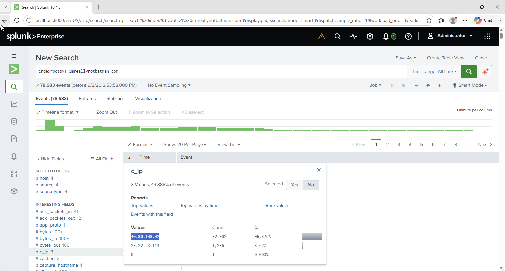

# Investigation 01 – Web Vulnerability Scanning

## Question

What is the likely IPv4 address of someone from the Po1s0n1vy group scanning `imreallynotbatman.com` for web application vulnerabilities?

## Investigation

I started with a broad search for the domain to see what logs and activity were available.

```spl
index=botsv1 imreallynotbatman.com
```

This returned a lot of events, so I narrowed the search down to HTTP traffic.

I then grouped the HTTP events by source IP and sorted them by the number of requests.

```spl
index=botsv1 imreallynotbatman.com sourcetype="stream:http"
| stats count by src_ip
| sort - count
```

This made it easier to see which IP addresses were generating the most traffic against the website.

## Finding

The suspicious source IP was:

**40.80.148.42**

## What I Found

`40.80.148.42` stood out when I compared the HTTP activity by source IP.

The amount of traffic coming from this IP, combined with the fact that the investigation was looking for vulnerability-scanning activity, made it the IP I wanted to investigate further.

This was useful because instead of looking through thousands of individual HTTP events, I used `stats` to group the activity and quickly identify the source generating the suspicious requests.

## Evidence



## SPL Used

```spl
index=botsv1 imreallynotbatman.com sourcetype="stream:http"
| stats count by src_ip
| sort - count
```

## SOC Takeaway

One thing I took from this investigation is that when there are a large number of network events, looking at each event individually isn't always the best starting point.

Using SPL to group activity by source IP helped me narrow the investigation down quickly. From there, I could take the suspicious IP and correlate it with other logs to understand what the attacker did next.
