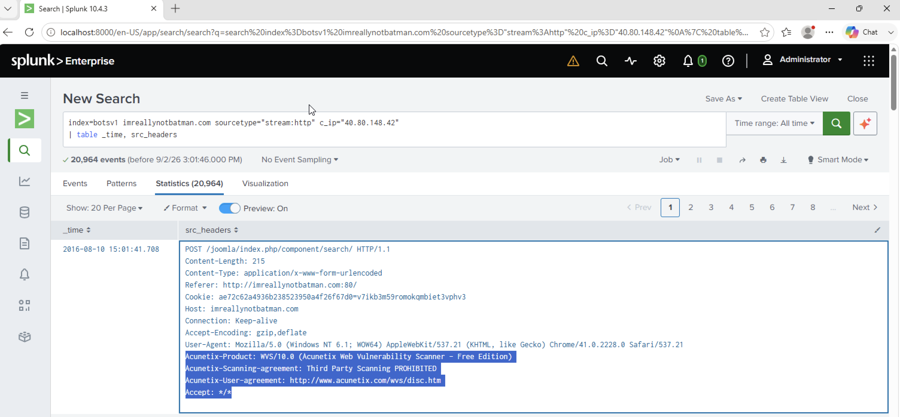

# Investigation 02 – Vulnerability Scanner Identification

## Question

What company created the web vulnerability scanner used by Po1s0n1vy?

## Investigation

After identifying `40.80.148.42` as the IP responsible for the scanning activity, I focused on the HTTP traffic coming from that address and reviewed the request headers.

```spl
index=botsv1 imreallynotbatman.com sourcetype="stream:http" c_ip="40.80.148.42"
| table _time, src_headers
```

While reviewing the headers, I found:

`Acunetix-Product: WVS/10.0 (Acunetix Web Vulnerability Scanner - Free Edition)`

This showed that the scanning activity was being performed using the Acunetix Web Vulnerability Scanner.

## Finding

**Acunetix**

## Evidence



## SOC Takeaway

HTTP request headers can provide useful information about the tools generating suspicious traffic. In this case, the scanner identified itself directly in the HTTP headers, allowing me to determine which vulnerability scanner was being used.
