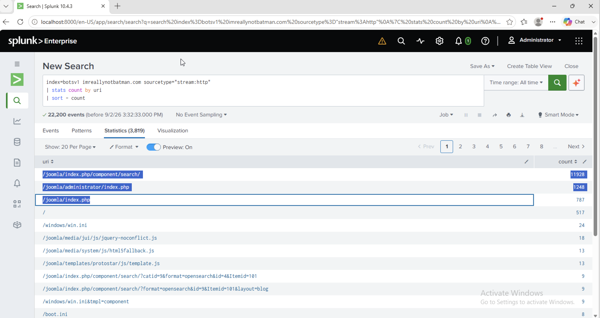

# Investigation 03 – CMS Identification

## Question

What content management system is `imreallynotbatman.com` likely using?

## Investigation

I reviewed the HTTP requests to `imreallynotbatman.com` and grouped them by URI to see which web application paths were being accessed most frequently.

```spl
index=botsv1 imreallynotbatman.com sourcetype="stream:http"
| stats count by uri
| sort - count
```

The results showed several paths associated with Joomla, including:

- `/joomla/index.php/component/search/`
- `/joomla/administrator/index.php`
- `/joomla/index.php`
- `/joomla/media/`
- `/joomla/templates/`

The repeated Joomla-specific paths indicated that the website was running the Joomla content management system.

## Finding

**Joomla**

## Evidence



## SOC Takeaway

URI patterns can reveal the technology running behind a web application. Recognising application-specific directories such as Joomla's `/administrator/`, `/media/`, and `/templates/` can help identify the platform being targeted and provide useful context during an investigation.
