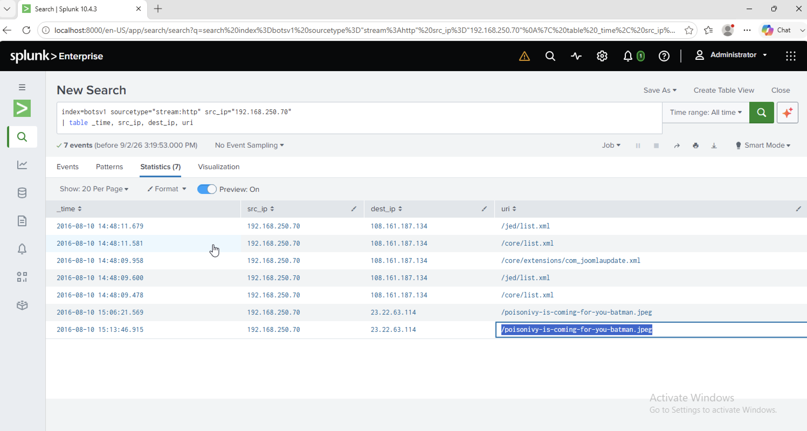

# Investigation 04 – Website Defacement File

## Question

What is the name of the file that defaced the `imreallynotbatman.com` website?

## Investigation

I first identified the internal IP address hosting `imreallynotbatman.com` by reviewing the destination IPs receiving the website's HTTP traffic. This identified the web server as `192.168.250.70`.

Because the attacker had taken control of the server, I then investigated outbound HTTP traffic where the compromised web server appeared as the source.

```spl
index=botsv1 sourcetype="stream:http" src_ip="192.168.250.70"
| table _time, src_ip, dest_ip, uri
```

The results showed the web server making outbound requests to `23.22.63.114`. Among the requested resources was a suspicious JPEG file:

`/poisonivy-is-coming-for-you-batman.jpeg`

The filename and the outbound request from the compromised server linked this file to the website defacement activity.

## Finding

**poisonivy-is-coming-for-you-batman.jpeg**

## Evidence



## SOC Takeaway

A compromised web server does not always appear as the destination of suspicious traffic. After gaining control of a server, an attacker may cause it to make outbound connections to retrieve additional content or tools. Checking both inbound and outbound traffic helped identify the file associated with the defacement.
