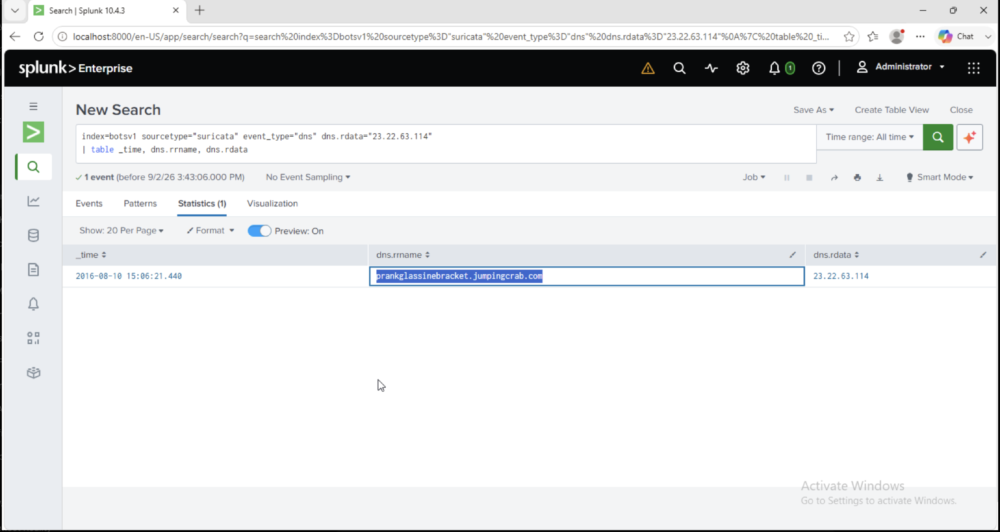

# Investigation 05 – Dynamic DNS FQDN

## Question

This attack used dynamic DNS to resolve to the malicious IP. What fully qualified domain name (FQDN) is associated with this attack?

## Investigation

From the previous investigation, I had already identified `23.22.63.114` as infrastructure associated with the attack.

I pivoted from that IP into Suricata DNS events to determine whether any domain name had resolved to it.

```spl
index=botsv1 sourcetype="suricata" event_type="dns" dns.rdata="23.22.63.114"
| table _time, dns.rrname, dns.rdata
```

The search returned a DNS answer showing:

`prankglassinebracket.jumpingcrab.com` → `23.22.63.114`

This connected the previously identified malicious IP address to a dynamic DNS hostname.

## Finding

**FQDN:** `prankglassinebracket.jumpingcrab.com`

**Resolved IP:** `23.22.63.114`

## Evidence



## SOC Takeaway

DNS telemetry is useful when pivoting from a known malicious IP address. Identifying domains that resolve to an IOC can reveal additional attacker infrastructure and provide indicators that can be searched across other security logs.
