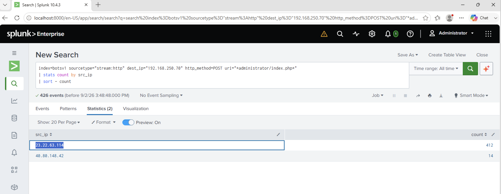

# Investigation 08 – Brute Force Attack Against imreallynotbatman.com

## Question

What IP address is likely attempting a brute force password attack against imreallynotbatman.com?

## Investigation

I focused on HTTP POST requests targeting the Joomla administrator login page on the web server `192.168.250.70`.

I grouped the requests by source IP to identify which external address was repeatedly attempting to authenticate.

```spl
index=botsv1 sourcetype="stream:http" dest_ip="192.168.250.70" http_method=POST uri="*administrator/index.php*"
| stats count by src_ip
| sort - count
```

The results showed:

- `23.22.63.114` – 412 POST requests
- `40.80.148.42` – 14 POST requests

I also inspected the POST data and observed repeated login attempts using the `admin` username with different password values.

The combination of repeated POST requests against the administrator login page and changing password values was consistent with a brute-force password attack.

## Finding

**Brute Force Source IP:** `23.22.63.114`

## Evidence



## SOC Takeaway

A large number of requests alone is not enough to confirm brute force activity. In this case, the repeated POST requests to an authentication endpoint combined with multiple password attempts provided stronger evidence that the source IP was attempting to brute force the administrator account.
