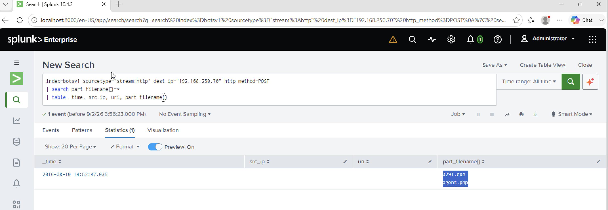

# Investigation 09 – Malicious Executable Upload

## Question

What is the name of the executable uploaded by Po1s0n1vy?

## Investigation

After identifying the brute-force activity against the Joomla administrator interface, I investigated HTTP POST requests sent to the web server `192.168.250.70`.

Since file uploads through web forms commonly use POST requests, I filtered the traffic for POST events where Splunk had extracted uploaded filenames.

```spl
index=botsv1 sourcetype="stream:http" dest_ip="192.168.250.70" http_method=POST
| search part_filename{}=*
| table _time, src_ip, uri, part_filename{}
```

The search reduced the activity to a single relevant upload event.

The `part_filename{}` field contained two uploaded filenames:

- `3791.exe`
- `agent.php`

Because the question specifically asks for the executable, I identified `3791.exe` as the uploaded executable.

## Finding

**Uploaded Executable:** `3791.exe`

## Evidence



## SOC Takeaway

HTTP POST telemetry can reveal files uploaded through compromised web applications. Filtering for extracted filename fields can help separate actual file-upload activity from other POST requests such as login attempts. The uploaded executable can then be used as an IOC for further endpoint, network, and threat-intelligence investigation.
