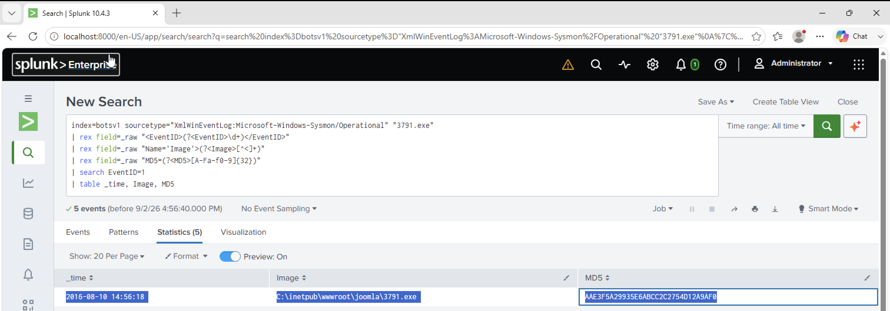

# Investigation 10 – MD5 Hash of Uploaded Executable

## Question

What is the MD5 hash of the executable uploaded?

## Investigation

In the previous investigation, I identified the executable uploaded to the compromised Joomla web server as:

`3791.exe`

The HTTP upload event identified the filename, but it did not provide the MD5 hash. I therefore pivoted from the HTTP logs to Sysmon telemetry and searched for activity involving `3791.exe`.

I started with:

```spl
index=botsv1 sourcetype="XmlWinEventLog:Microsoft-Windows-Sysmon/Operational" "3791.exe"
```

This returned Sysmon events containing references to the executable.

In my Splunk environment, fields such as the Sysmon Event ID, process image and MD5 hash were not automatically extracted from the XML data. I extracted the required values from the raw events and filtered for Sysmon Event ID 1 (Process Create).

```spl
index=botsv1 sourcetype="XmlWinEventLog:Microsoft-Windows-Sysmon/Operational" "3791.exe"
| rex field=_raw "<EventID>(?<EventID>\d+)</EventID>"
| rex field=_raw "Name='Image'>(?<Image>[^<]+)"
| rex field=_raw "MD5=(?<MD5>[A-Fa-f0-9]{32})"
| search EventID=1
| table _time, Image, MD5
```

The results contained several processes, so I correlated the `Image` field with the executable identified during the upload investigation.

The relevant Sysmon event showed:

- **Image:** `C:\inetpub\wwwroot\joomla\3791.exe`
- **MD5:** `AAE3F5A29935E6ABCC2C2754D12A9AF0`

This confirmed the MD5 hash belonging specifically to `3791.exe`.

## Finding

The MD5 hash of the uploaded executable was:

**`AAE3F5A29935E6ABCC2C2754D12A9AF0`**

## Evidence


