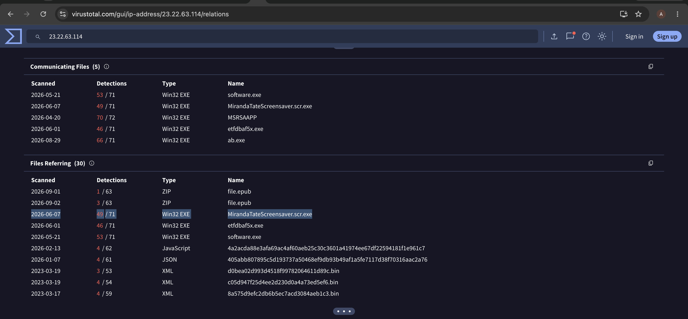
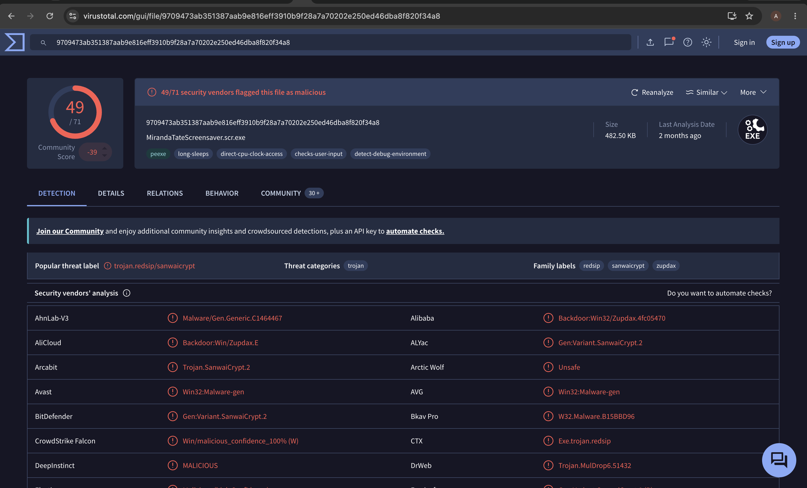

# Investigation 11 – Spear Phishing Malware OSINT

## Question

GCPD reported that common TTPs for the Po1s0n1vy APT group include spear phishing attacks using custom malware. Using research techniques, provide the SHA256 hash of this malware.

## Investigation

This question required an OSINT investigation rather than a Splunk search.

From my previous investigations, I had already identified the following IP address as part of the Po1s0n1vy attack infrastructure:

`23.22.63.114`

I used this IP as an IOC and searched it on VirusTotal.

I then reviewed the **Relations** associated with the IP and found several communicating files. One file stood out:

`MirandaTateScreensaver.scr.exe`

The file had been flagged as malicious by multiple security vendors, so I pivoted into the file itself to investigate it further.

VirusTotal showed the following SHA256 hash for the file:

`9709473ab351387aab9e816eff3910b9f28a7a70202e250ed46dba8f820f34a8`

This connected the known Po1s0n1vy infrastructure with the custom malware referenced in the investigation.

## Finding

The SHA256 hash associated with the malware was:

**`9709473ab351387aab9e816eff3910b9f28a7a70202e250ed46dba8f820f34a8`**

## Evidence

The first screenshot shows the pivot from the known attacker IP to the associated malware.

The second screenshot shows the malware file and its SHA256 hash.

