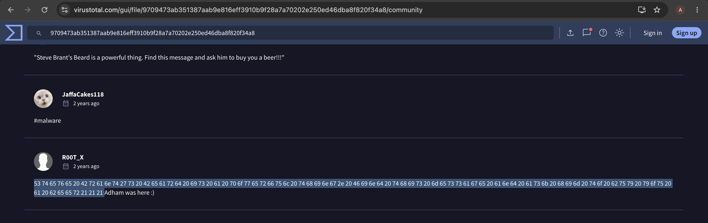

# Investigation 12 – Malware Hex Code OSINT

## Question

What special hex code is associated with the customized malware discussed in the previous investigation?

## Investigation

This question was not answered using Splunk, so I continued the OSINT investigation from the malware identified previously:

`MirandaTateScreensaver.scr.exe`

I returned to the VirusTotal report for the file and reviewed the **Community** section for additional information shared by security researchers.

One of the community comments contained a long hexadecimal string associated with the malware:

`53 74 65 76 65 20 42 72 61 6e 74 27 73 20 42 65 61 72 64 20 69 73 20 61 20 70 6f 77 65 72 66 75 6c 20 74 68 69 6e 67 2e 20 46 69 6e 64 20 74 68 69 73 20 6d 65 73 73 61 67 65 20 61 6e 64 20 61 73 6b 20 68 69 6d 20 74 6f 20 62 75 79 20 79 6f 75 20 61 20 62 65 65 72 21 21 21`

The community information also showed that the hexadecimal value decodes to:

`Steve Brant's Beard is a powerful thing. Find this message and ask him to buy you a beer!!!`

## Finding

The special hex code associated with the customized malware was:

**`53 74 65 76 65 20 42 72 61 6e 74 27 73 20 42 65 61 72 64 20 69 73 20 61 20 70 6f 77 65 72 66 75 6c 20 74 68 69 6e 67 2e 20 46 69 6e 64 20 74 68 69 73 20 6d 65 73 73 61 67 65 20 61 6e 64 20 61 73 6b 20 68 69 6d 20 74 6f 20 62 75 79 20 79 6f 75 20 61 20 62 65 65 72 21 21 21`**

## Evidence

