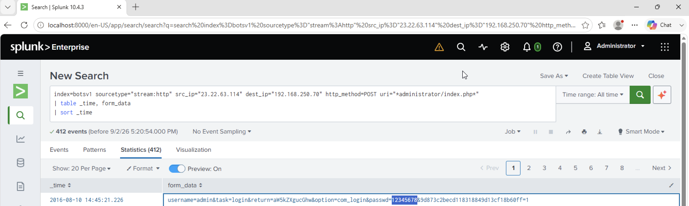

# Investigation 14 – First Brute Force Password Attempt

## Question

What was the first brute force password used?

## Investigation

In my previous investigation, I identified `23.22.63.114` as the IP address performing a brute force attack against the Joomla administrator login page.

To determine the first password attempted, I filtered the HTTP traffic for POST requests from the attacker IP to the Joomla administrator login page.

```spl
index=botsv1 sourcetype="stream:http" src_ip="23.22.63.114" dest_ip="192.168.250.70" http_method=POST uri="*administrator/index.php*"
| table _time, form_data
| sort _time
```

I sorted the events chronologically so that the earliest login attempt appeared first.

Reviewing the `form_data` from the earliest event showed the password submitted during the first brute force attempt.

## Finding

The first password attempted during the brute force attack was:

**`12345678`**

## Evidence


