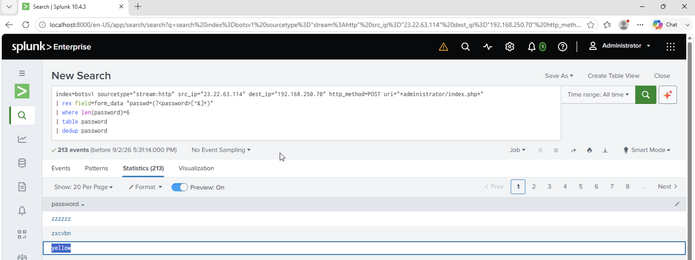

# Investigation 15 – Six-Character Brute Force Password

## Question

One of the passwords in the brute force attack is a six-character word that is also the name of a Coldplay song. What is the password?

## Investigation

I already identified `23.22.63.114` as the source of the brute force attack against the Joomla administrator login page.

Since the question specified that the password contained six characters, I extracted the password values from the HTTP POST data and filtered the results by password length.

```spl
index=botsv1 sourcetype="stream:http" src_ip="23.22.63.114" dest_ip="192.168.250.70" http_method=POST uri="*administrator/index.php*"
| rex field=form_data "passwd=(?<password>[^&]+)"
| where len(password)=6
| table password
| dedup password
```

This reduced the brute force attempts to unique six-character passwords.

Reviewing the remaining candidates revealed `yellow`, which matches the name of the Coldplay song "Yellow".

## Finding

The six-character password was:

**`yellow`**

## Evidence


