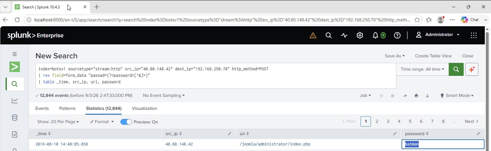

# Investigation 16 – Correct Joomla Administrator Password

## Question

What was the correct password for the Joomla administrator account?

## Investigation

From the previous brute-force investigation, I knew that `23.22.63.114` was responsible for the large number of password attempts against the Joomla administrator login.

Instead of searching directly for the correct password, I first checked which IP addresses were submitting passwords to the administrator page.

```spl
index=botsv1 sourcetype="stream:http" dest_ip="192.168.250.70" http_method=POST
| rex field=form_data "passwd=(?<password>[^&]+)"
| where isnotnull(password)
| stats count by src_ip
```

The results showed:

- `23.22.63.114` – 412 attempts
- `40.80.148.42` – 1 attempt

The second IP stood out because it submitted only a single password compared with the brute-force source.

I then pivoted to `40.80.148.42` to inspect the password it submitted.

```spl
index=botsv1 sourcetype="stream:http" src_ip="40.80.148.42" dest_ip="192.168.250.70" http_method=POST
| rex field=form_data "passwd=(?<password>[^&]+)"
| table _time, src_ip, uri, password
```

## Findings

The request was made to:

`/joomla/administrator/index.php`

The password submitted by `40.80.148.42` was:

`batman`

This was different from the hundreds of password guesses originating from `23.22.63.114` and identified the valid administrator password.

## Answer

**batman**

## Evidence


