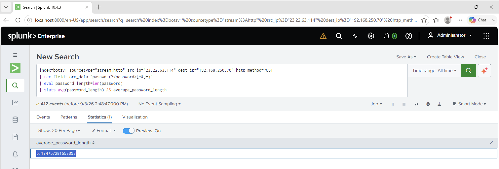

# Investigation 17 – Average Brute-Force Password Length

## Question

What was the average password length used in the password brute-forcing attempt? Round to the closest whole integer.

## Investigation

I continued investigating the password attempts originating from the brute-force IP address:

`23.22.63.114`

I extracted each password from the HTTP POST form data and calculated the length of each password using Splunk's `len()` function.

I then calculated the average across all of the password attempts.

```spl
index=botsv1 sourcetype="stream:http" src_ip="23.22.63.114" dest_ip="192.168.250.70" http_method=POST
| rex field=form_data "passwd=(?<password>[^&]+)"
| eval password_length=len(password)
| stats avg(password_length) AS average_password_length
```

## Findings

Splunk calculated the average password length as:

`6.174757281553398`

The question asks for the result rounded to the closest whole integer.

This gives an average password length of:

`6`

## Answer

**6**

## Evidence


