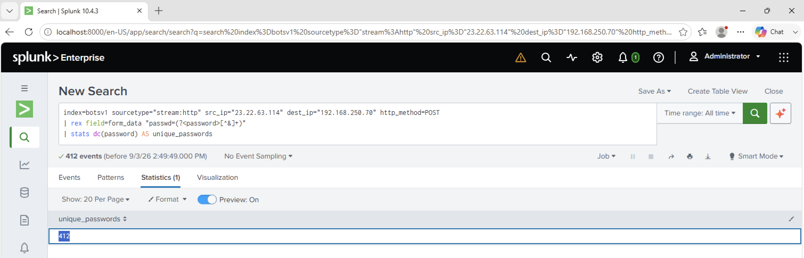

# Investigation 18 – Unique Passwords Attempted

## Question

How many unique passwords were attempted during the brute-force attack?

## Investigation

I continued analyzing the HTTP POST requests originating from the previously identified brute-force IP address:

`23.22.63.114`

I extracted the password value from the POST form data and used Splunk's `dc()` function to count the number of distinct passwords attempted.

```spl
index=botsv1 sourcetype="stream:http" src_ip="23.22.63.114" dest_ip="192.168.250.70" http_method=POST
| rex field=form_data "passwd=(?<password>[^&]+)"
| stats dc(password) AS unique_passwords
```

## Findings

The search returned:

`412`

This means the attacker attempted 412 unique passwords against the Joomla administrator login.

The result also shows that the brute-force activity was not repeatedly cycling through a small set of passwords; each of the 412 extracted password values was unique.

## Answer

**412**

## Evidence


