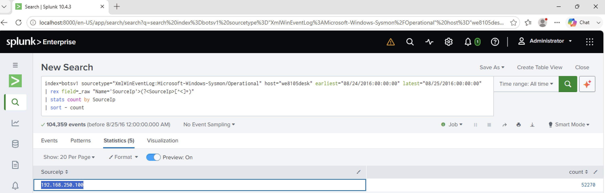

# Investigation 19 – Identifying the IP Address of we8105desk

## Question

What was the most likely IP address of `we8105desk` on 24AUG2016?

## Investigation

I first searched for activity containing the hostname `we8105desk` on 24 August 2016 and checked which log sources contained the most evidence.

```spl
index=botsv1 "we8105desk" earliest="08/24/2016:00:00:00" latest="08/25/2016:00:00:00"
| stats count by sourcetype
| sort - count
```

Sysmon contained a large amount of telemetry associated with the workstation, so I used it to investigate the network activity originating from the host.

Because `SourceIp` was not automatically extracted from the Sysmon XML in my environment, I extracted it directly from the raw event.

```spl
index=botsv1 sourcetype="XmlWinEventLog:Microsoft-Windows-Sysmon/Operational" host="we8105desk" earliest="08/24/2016:00:00:00" latest="08/25/2016:00:00:00"
| rex field=_raw "Name='SourceIp'>(?<SourceIp>[^<]+)"
| stats count by SourceIp
| sort - count
```

## Findings

The results showed several source addresses, including broadcast, multicast and loopback addresses.

The dominant normal host address was:

`192.168.250.100`

It appeared in **52,270 Sysmon events**, substantially more than the other extracted source addresses.

This identified `192.168.250.100` as the most likely IP address assigned to `we8105desk`.

## Answer

**192.168.250.100**

## Evidence


