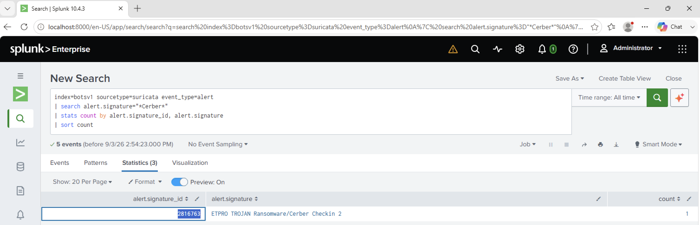

# Investigation 20 – Cerber Suricata Signature Analysis

## Question

Amongst the Suricata signatures that detected the Cerber malware, which one alerted the fewest number of times?

## Investigation

I searched the Suricata alert logs for signatures containing the term `Cerber`.

I then grouped the events by signature ID and signature name and counted how many times each detection occurred.

```spl
index=botsv1 sourcetype=suricata event_type=alert
| search alert.signature="*Cerber*"
| stats count by alert.signature_id, alert.signature
| sort count
```

## Findings

The search returned three Cerber-related Suricata signatures.

The signature with the lowest number of alerts was:

`ETPro TROJAN Ransomware/Cerber Checkin 2`

It generated only **1 alert**.

The corresponding Suricata signature ID was:

`2816763`

The other Cerber signatures each generated two alerts, making `2816763` the least frequently triggered signature.

## Answer

**2816763**

## Evidence


