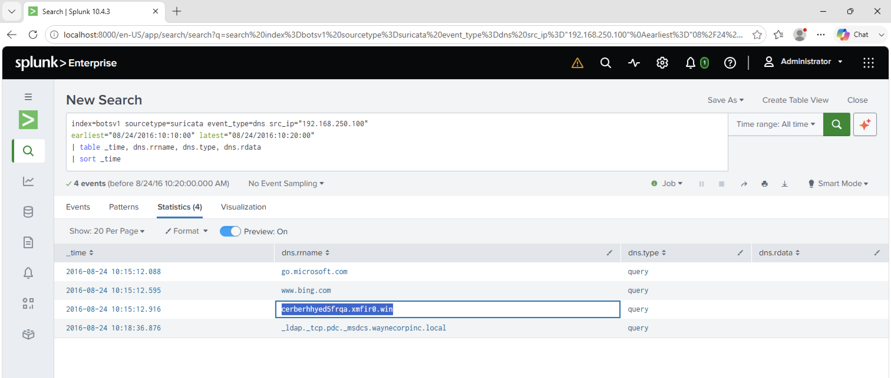

# Investigation 21 – Cerber Ransomware FQDN

## Question

What fully qualified domain name (FQDN) does the Cerber ransomware attempt to direct the user to at the end of its encryption phase?

## Investigation

From the previous investigation, I identified Cerber-related Suricata alerts originating from the infected workstation `192.168.250.100`.

I first reviewed the Cerber alerts and noticed an `Onion Domain Lookup` detection at approximately 10:15 on 24 August 2016.

To investigate the DNS activity surrounding that detection, I narrowed the search to a ten-minute window around the alert.

```spl
index=botsv1 sourcetype=suricata event_type=dns src_ip="192.168.250.100"
earliest="08/24/2016:10:10:00" latest="08/24/2016:10:20:00"
| table _time, dns.rrname, dns.type, dns.rdata
| sort _time
```

## Findings

The DNS activity included several legitimate domains such as:

- `go.microsoft.com`
- `www.bing.com`

However, immediately around the Cerber Onion Domain Lookup activity, the workstation queried:

`cerberhhyed5frqa.xmfir0.win`

The timing and Cerber-specific domain pattern made this DNS request stand out from the normal workstation traffic.

## Answer

**cerberhhyed5frqa.xmfir0.win**

## Evidence


