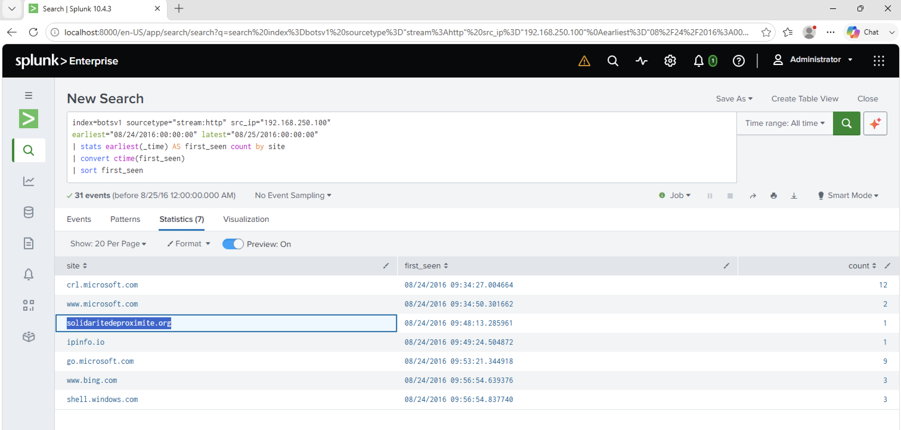

# Investigation 22 – First Suspicious Domain Visited by we8105desk

## Question

What was the first suspicious domain visited by `we8105desk` on 24AUG2016?

## Investigation

From the previous investigation, I identified the IP address associated with `we8105desk` as:

`192.168.250.100`

I used this IP to investigate HTTP activity from the workstation on 24 August 2016.

Rather than searching directly for a known malicious domain, I grouped the HTTP traffic by site and identified when each domain was first contacted.

```spl
index=botsv1 sourcetype="stream:http" src_ip="192.168.250.100"
earliest="08/24/2016:00:00:00" latest="08/25/2016:00:00:00"
| stats earliest(_time) AS first_seen count by site
| convert ctime(first_seen)
| sort first_seen
```

## Findings

The earliest domains included normal Microsoft infrastructure such as:

- `crl.microsoft.com`
- `www.microsoft.com`

The next domain that stood out was:

`solidaritedeproximite.org`

It was first contacted at approximately **09:48:13**.

This timing also closely aligned with the beginning of the suspicious activity that led into the Cerber ransomware infection.

## Answer

**solidaritedeproximite.org**

## Evidence


