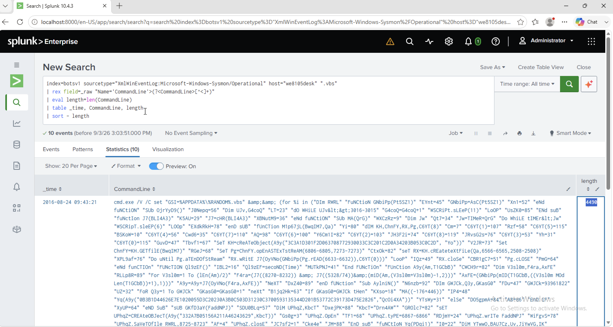

# Investigation 23 – Cerber VBScript Command Length

## Question

During the initial Cerber infection, a VBScript is run. The entire script from this execution, pre-pended by the name of the launching `.exe`, can be found in a field in Splunk.

What is the length in characters of the value of this field?

## Investigation

I started by looking for VBScript execution on the infected workstation `we8105desk`.

The Sysmon events showed `WScript.exe` executing a `.vbs` file during the suspicious activity.

I then searched the Sysmon telemetry for `.vbs` activity and extracted the `CommandLine` field directly from the raw XML because the field was not automatically extracted in my Splunk environment.

```spl
index=botsv1 sourcetype="XmlWinEventLog:Microsoft-Windows-Sysmon/Operational" host="we8105desk" ".vbs"
| rex field=_raw "Name='CommandLine'>(?<CommandLine>[^<]+)"
| eval length=len(CommandLine)
| table _time, CommandLine, length
| sort - length
```

## Findings

One event at approximately **09:43:21 on 24 August 2016** stood out immediately.

Unlike the normal `WScript.exe` command lines that only referenced a `.vbs` file, this event contained a very large command line beginning with:

`cmd.exe /V /C set ...`

The command line contained the VBScript content itself.

I used Splunk's `len()` function to calculate the number of characters in the extracted `CommandLine` value.

Splunk returned:

`4490`

## Answer

**4490**

## Evidence


