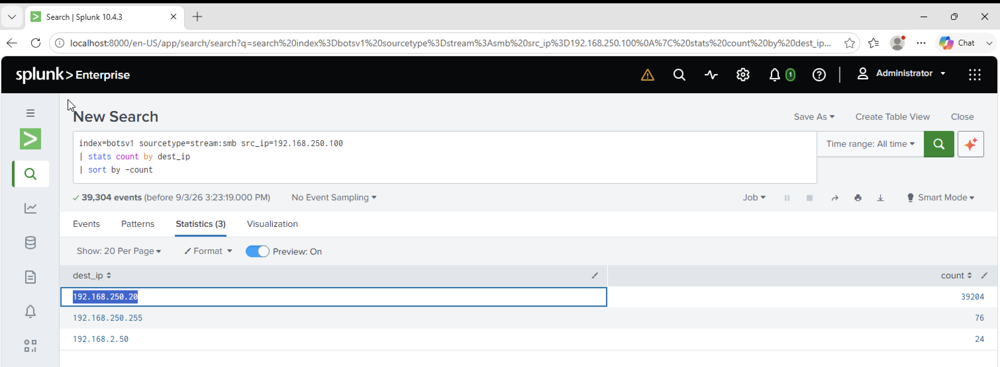

# Investigation 25 – File Server IP Address

## Question

What is the IP address of the file server?

## Investigation

From my previous investigation, I identified Bob Smith's workstation IP address as `192.168.250.100`.

Since I was looking for a file server, I focused on SMB traffic from Bob's workstation and checked which destination IP address received the most SMB connections.

```spl
index=botsv1 sourcetype=stream:smb src_ip=192.168.250.100
| stats count by dest_ip
| sort by -count
```

The results showed that `192.168.250.20` had significantly more SMB activity than the other destination IP addresses, with 39,204 events.

## Evidence



## Finding

The large amount of SMB traffic between Bob Smith's workstation and `192.168.250.20` identified this system as the file server.

## Answer

**192.168.250.20**
