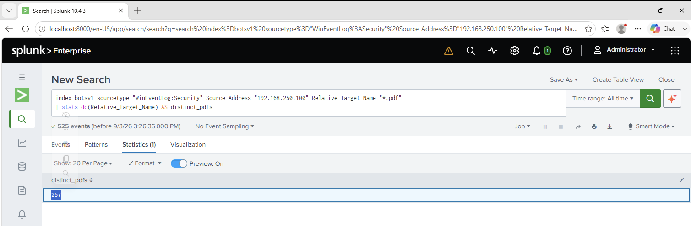

# Investigation 26 – Distinct PDF Files Encrypted

## Question

How many distinct PDF files were encrypted on the remote file server?

## Investigation

From my previous investigation, I identified Bob Smith's workstation as `192.168.250.100` and the file server as `192.168.250.20`.

I initially investigated the SMB traffic between the workstation and file server, but counting PDF filenames from the SMB logs did not give the correct result.

I then moved to the Windows Security logs, where file-share access activity contained the `Relative_Target_Name` field.

I searched for PDF files accessed from Bob Smith's workstation and counted the number of distinct filenames.

```spl
index=botsv1 sourcetype="WinEventLog:Security" Source_Address="192.168.250.100" Relative_Target_Name="*.pdf"
| stats dc(Relative_Target_Name) AS distinct_pdfs
```

The search returned **257** distinct PDF files.

## Evidence



## Finding

The Windows Security file-share activity showed that Bob Smith's infected workstation accessed **257 distinct PDF files** on the remote file server during the ransomware activity.

## Answer

**257**
