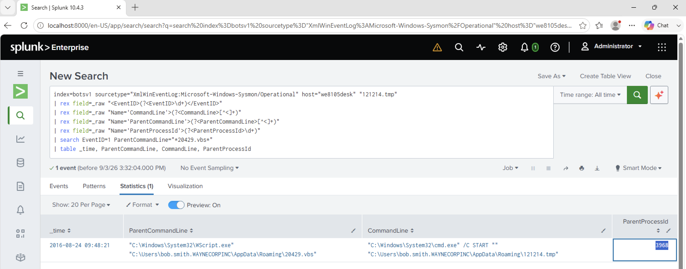

# Investigation 27 – 121214.tmp Parent Process ID

## Question

The VBScript found earlier launches `121214.tmp`. What is the ParentProcessId of this initial launch?

## Investigation

From my previous investigation, I identified the suspicious VBScript as `20429.vbs`.

I searched the Sysmon logs on Bob Smith's workstation for process creation events involving `121214.tmp`.

Because the Sysmon fields were contained inside the raw XML events, I extracted the Event ID, command line, parent command line, and ParentProcessId.

```spl
index=botsv1 sourcetype="XmlWinEventLog:Microsoft-Windows-Sysmon/Operational" host="we8105desk" "121214.tmp"
| rex field=_raw "<EventID>(?<EventID>\d+)</EventID>"
| rex field=_raw "Name='CommandLine'>(?<CommandLine>[^<]+)"
| rex field=_raw "Name='ParentCommandLine'>(?<ParentCommandLine>[^<]+)"
| rex field=_raw "Name='ParentProcessId'>(?<ParentProcessId>\d+)"
| search EventID=1 ParentCommandLine="*20429.vbs*"
| table _time, ParentCommandLine, CommandLine, ParentProcessId
```

The result showed the parent command line running:

`WScript.exe ...\20429.vbs`

The child command then launched:

`121214.tmp`

The `ParentProcessId` associated with this initial launch was **3968**.

## Evidence



## Finding

By correlating the Sysmon process creation event with the previously identified `20429.vbs` script, I confirmed that the initial launch of `121214.tmp` had a ParentProcessId of `3968`.

## Answer

**3968**
