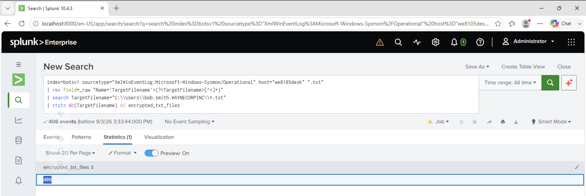

# Investigation 28 – Cerber TXT Files Encrypted

## Question

The Cerber ransomware encrypts files located in Bob Smith's Windows profile. How many `.txt` files does it encrypt?

## Investigation

After identifying the Cerber ransomware activity on Bob Smith's workstation, I wanted to determine how many text files within his Windows profile were affected.

I searched the Sysmon logs on `we8105desk` for `.txt` file activity.

Because `TargetFilename` was contained within the raw Sysmon XML, I extracted the field and then restricted the results to `.txt` files located inside Bob Smith's Windows profile.

Finally, I used `dc()` to count the number of distinct filenames.

```spl
index=botsv1 sourcetype="XmlWinEventLog:Microsoft-Windows-Sysmon/Operational" host="we8105desk" ".txt"
| rex field=_raw "Name='TargetFilename'>(?<TargetFilename>[^<]+)"
| search TargetFilename="C:\\Users\\bob.smith.WAYNECORPINC\\*.txt"
| stats dc(TargetFilename) AS encrypted_txt_files
```

The search returned **406** distinct `.txt` files.

## Evidence



## Finding

The Sysmon file activity showed that the Cerber ransomware affected **406 distinct `.txt` files** located within Bob Smith's Windows profile.

## Answer

**406**
