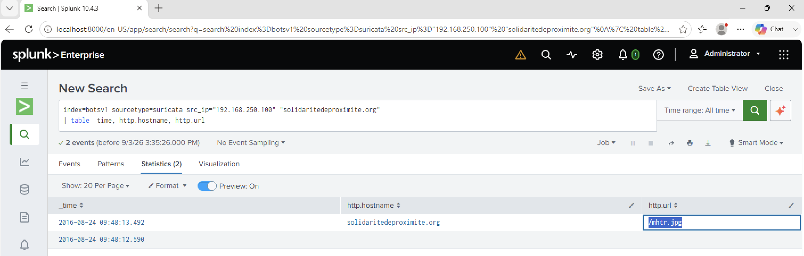

# Investigation 29 – Cerber Ransomware Encryptor File

## Question

The malware downloads a file that contains the Cerber ransomware cryptor code. What is the name of that file?

## Investigation

After identifying the Cerber ransomware activity on Bob Smith's workstation, I investigated the network traffic to determine which file contained the ransomware cryptor code.

From my previous investigation, I had already identified `solidaritedeproximite.org` as a suspicious domain contacted by Bob Smith's workstation.

I searched the Suricata network logs for traffic from Bob's workstation, `192.168.250.100`, to this domain and displayed the HTTP hostname and requested URL.

```spl
index=botsv1 sourcetype=suricata src_ip="192.168.250.100" "solidaritedeproximite.org"
| table _time, http.hostname, http.url
```

The results showed an HTTP request to:

`solidaritedeproximite.org/mhtr.jpg`

The requested filename was:

`mhtr.jpg`

## Evidence



## Finding

The Suricata network traffic showed Bob Smith's infected workstation requesting `mhtr.jpg` from the previously identified malicious domain `solidaritedeproximite.org`.

This identified `mhtr.jpg` as the file containing the Cerber ransomware cryptor code.

## Answer

**mhtr.jpg**
