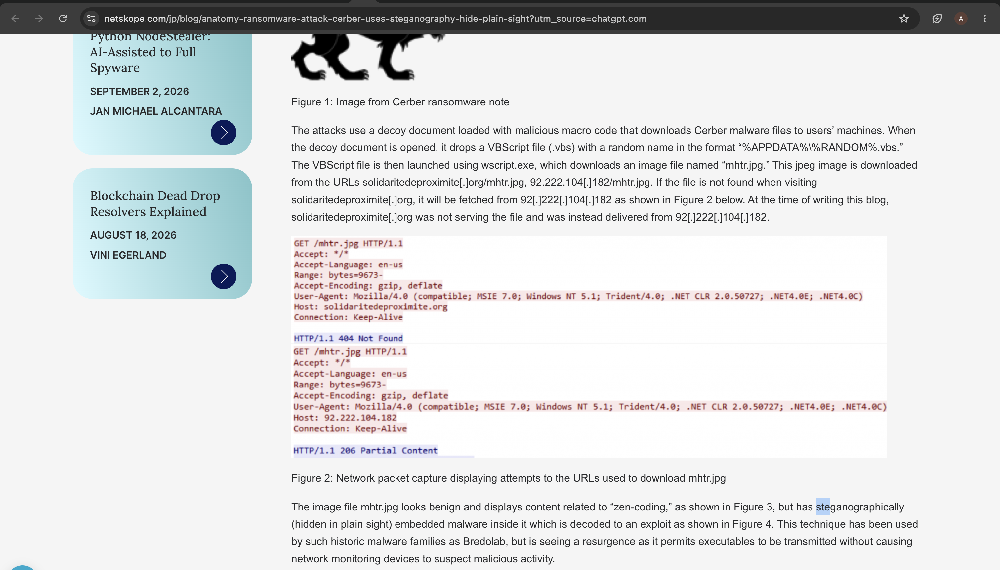

# Investigation 30 – Cerber Ransomware Obfuscation Technique

## Question

Now that I know the name of the ransomware's encryptor file, what obfuscation technique does it likely use?

## Investigation

In my previous investigation, I identified `mhtr.jpg` as the file downloaded by the malware containing the Cerber ransomware cryptor code.

Since the file used a `.jpg` extension, the obfuscation technique could not be determined directly from the Splunk logs. I therefore used OSINT to research the identified filename and its connection to Cerber ransomware.

I found a Netskope Threat Labs analysis describing the same Cerber infection chain and specifically referencing `mhtr.jpg`.

The analysis explains that the VBScript downloads `mhtr.jpg` from:

`solidaritedeproximite.org/mhtr.jpg`

It also explains that although the file appears to be a benign JPEG image, malware is embedded inside the image and later decoded.

Netskope describes the malware as being **steganographically embedded** inside the image.

This identified the technique as **steganography**.

## Evidence

## Finding

Using OSINT after identifying `mhtr.jpg` in the Splunk investigation showed that the Cerber cryptor code was hidden inside what appeared to be a legitimate JPEG image.

The technique used to conceal the malicious code is **steganography**, which allows information or malicious content to be hidden inside another file so that it appears benign.

## Answer

**Steganography**
